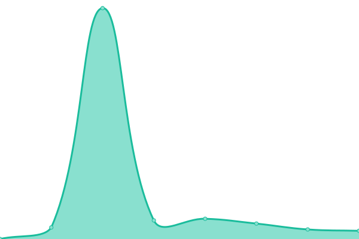

# [📈 Live Status](https://getmateo.github.io/upptime): <!--live status--> **🟩 All systems operational**

This repository contains the open-source uptime monitor and status page for [mateo](https://hellomateo.de), powered by [Upptime](https://github.com/upptime/upptime).

With [Upptime](https://upptime.js.org), you can get your own unlimited and free uptime monitor and status page, powered entirely by a GitHub repository. We use [Issues](https://github.com/getmateo/upptime/issues) as incident reports, [Actions](https://github.com/getmateo/upptime/actions) as uptime monitors, and [Pages](https://getmateo.github.io/upptime) for the status page.

<!--start: status pages-->
<!-- This summary is generated by Upptime (https://github.com/upptime/upptime) -->
<!-- Do not edit this manually, your changes will be overwritten -->
<!-- prettier-ignore -->
| URL | Status | History | Response Time | Uptime |
| --- | ------ | ------- | ------------- | ------ |
|  [Mateo App PROD](https://app.getmateo.com) | 🟩 Up | [mateo-app-prod.yml](https://github.com/getmateo/upptime/commits/HEAD/history/mateo-app-prod.yml) | 

 1811ms
     
 | 

<a href="https://status.getmateo.com/history/mateo-app-prod">100.00%</a>
    

|  [Mateo App DEV](https://app.dev.getmateo.com) | 🟩 Up | [mateo-app-dev.yml](https://github.com/getmateo/upptime/commits/HEAD/history/mateo-app-dev.yml) | 

 590ms
     
 | 

<a href="https://status.getmateo.com/history/mateo-app-dev">100.00%</a>
    

|  [Mateo Web PROD](https://www.hellomateo.de/) | 🟩 Up | [mateo-web-prod.yml](https://github.com/getmateo/upptime/commits/HEAD/history/mateo-web-prod.yml) | 

 306ms
     
 | 

<a href="https://status.getmateo.com/history/mateo-web-prod">100.00%</a>
    

<!--end: status pages-->

[**Visit our status website →**](https://getmateo.github.io/upptime)

## 📄 License

- Powered by: [Upptime](https://github.com/upptime/upptime)
- Code: [MIT](./LICENSE) © [mateo](https://hellomateo.de)
- Data in the `./history` directory: [Open Database License](https://opendatacommons.org/licenses/odbl/1-0/)
